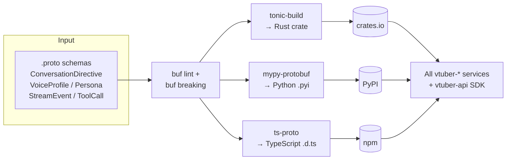

# System Architecture

## 🏗️ High-Level Overview
vtuber-contracts is the build-time source of truth for all inter-service typed boundaries in the vtuber-* program. It defines proto3 schemas for messages such as ConversationDirective, VoiceProfile, and Persona, then runs codegen to publish a Rust crate, Python typed stubs (.pyi), and TypeScript declaration files consumed by every other vtuber-* repo and by the public SDK shipped through vtuber-api.

## 🗺️ Component Diagram

## 🛠️ Technology Stack
- **Programming Languages:** Rust, Protobuf (proto3)
- **Tooling & Infrastructure:** buf (lint + breaking-change gate), tonic (Rust gRPC codegen), ts-proto (TypeScript codegen), mypy-protobuf (Python typed stub codegen), crates.io / PyPI / npm registries
- **Core Pattern:** Single Source of Truth (one schema, many languages)
- **Strategy:** Codegen-driven boundary — every vtuber-* repo consumes generated artifacts; breaking changes here trigger CI failures in all downstream consumers before merge.

## 🔗 Internal References
- Engineering rules: [PRINCIPLES.md](PRINCIPLES.md)
- Live project map: [STRUCTURE.tree](STRUCTURE.tree)
